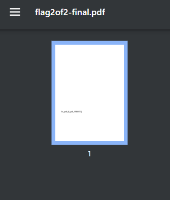

# 2024 Pico CTF 문제 풀이

## 3. 문제: "Secret of the Polyglot"

### 문제 설명  
이 문제는 하나의 파일이 여러 형식을 동시에 가질 수 있다는 점을 이용한 문제였다.  
처음에는 PDF 파일처럼 보였으나, 실제로는 이미지 형식이 포함되어 있는 "polyglot 파일"이라는 점을 파악해야 했다.
   

### 풀이 과정

1. **파일 다운로드**  
   문제에서 제공된 `flag2of2-final` 파일을 다운로드하였다.  
   파일 확장자는 `.pdf`이지만, 단순히 확장자만 보고 판단하지 않고 파일 포맷을 분석할 필요가 있다.  
   

2. **PDF로 열어보기**  
   파일을 PDF 리더로 열어보면 문서 안에 `1n_pn9_&_pdf_1f991f77}`라는 문자열이 포함된 것을 확인할 수 있다.  
   이는 플래그의 일부로 보이며 앞부분이 누락된 형태였다.  
   

3. **파일 형식 분석 (Linux 환경)**  
   `file flag2of2-final` 명령어를 사용하여 파일 형식을 분석해 보면, 해당 파일이 PNG 이미지라는 것을 알 수 있다.  
   이는 polyglot 기법으로 만들어진 파일임을 시사한다.  
   

   

   
4. **이미지 뷰어로 열어보기**  
   PDF가 아닌 이미지 뷰어를 통해 해당 파일을 열면, 플래그의 앞부분까지 확인할 수 있으며 전체 플래그가 완성된다.  
   최종 플래그는 `picoCTF{f1u3n7_1n_pn9_&_pdf_1f991f77}`이다.  
   

### 결론 및 통찰  
이 문제는 파일의 **확장자만 보고 판단해서는 안 되며**, 파일 내부 포맷을 분석하는 습관이 중요하다는 점을 보여준다.  

---

### 해결 방법

1. `flag2of2-final` 파일 다운로드  
2. PDF 뷰어로 열어 일부 플래그 확인  
3. `file` 명령어로 실제 파일 형식 분석 → PNG 이미지임을 확인  
4. 이미지 뷰어로 열어 전체 플래그 확인  
5. 최종 플래그: `picoCTF{f1u3n7_1n_pn9_&_pdf_1f991f77}`
