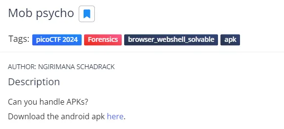
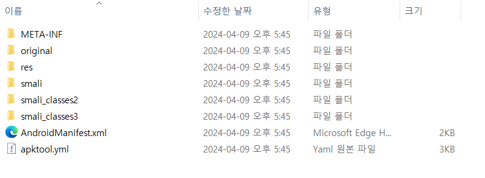
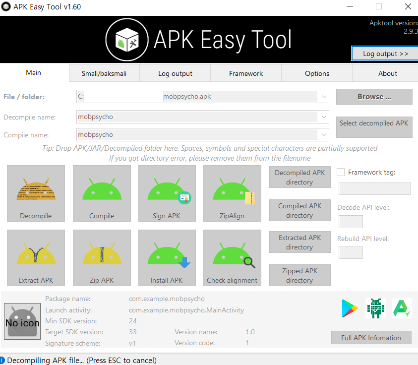
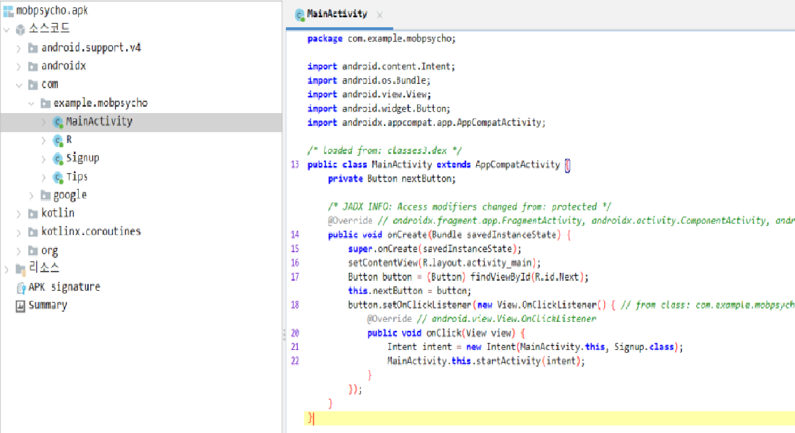
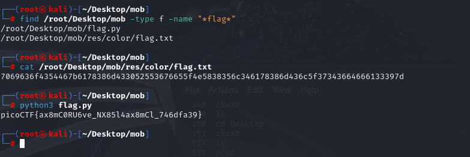
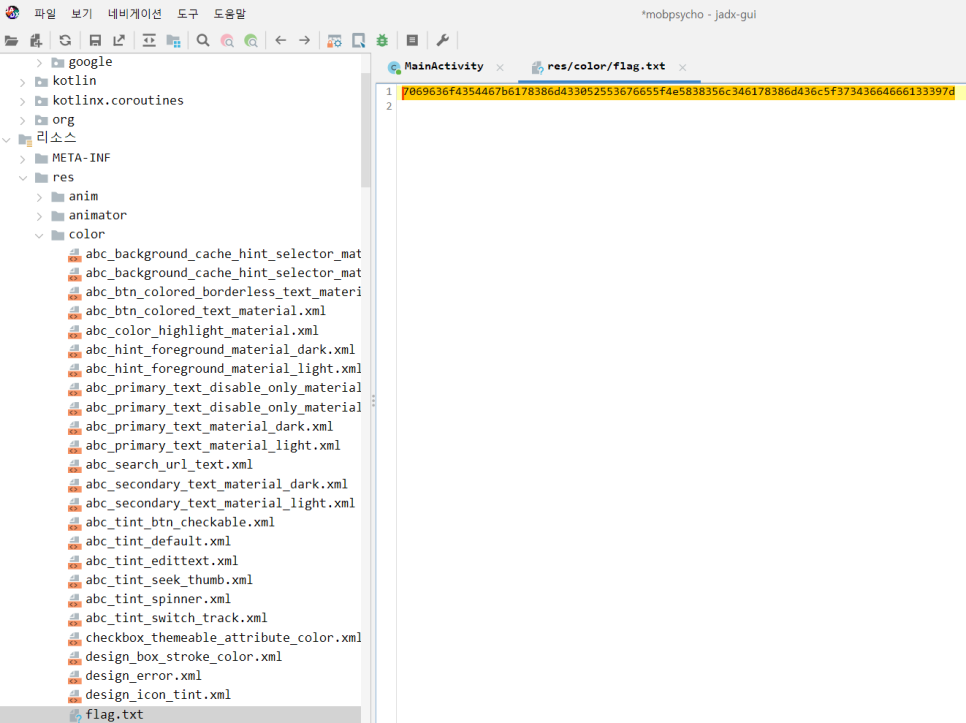

# 2024 Pico CTF 문제 풀이

## 1. 문제 1: "Mob Psycho"

### 문제 설명:
이 문제는 APK 형식의 파일을 다운로드 받아 분석한 뒤, 내부에서 플래그를 추출하는 것이 목표였다.
<p align="center"><br>

### 풀이 과정:

1. **APK 파일 다운로드**  
   문제에서 제공한 APK 파일을 다운로드한 후, BlueStacks를 통해 앱 설치를 시도했으나 실패하였다.<br>따라서 직접 파일을 분석하는 방식으로 전환하였다.<br> 
   <p align="center"><br>


2. **APK 압축 해제 및 구조 확인**  
   APK 파일은 ZIP 형식이므로 압축 해제를 통해 내부 구조를 확인할 수 있다.<br>
   압축 해제 후 내부 디렉토리 구조는 다음과 같았다:

   ```
   MobPsycho/
   ├── META-INF/
   ├── original/
   ├── res/
   ├── smail/
   ├── AndroidManifest.xml
   └── apktool.yml
   ```

   <p align="center"></p>

3. **디컴파일 (APK Easy Tool 사용)**  
   디컴파일 도구인 **APK Easy Tool**을 사용하여 소스 코드를 추출하였다.  
   <p align="center"></p>

4. **MainActivity 분석**  
   디컴파일 결과 중 핵심 액티비티인 `MainActivity`를 확인하였다.  
   그러나 여기서는 플래그 관련 직접적인 단서는 없었다.  
   <p align="center"><br>

5. **플래그 탐색 (find + grep 사용)**  
   수동 분석 대신 `find` + `grep` 명령어로 전체 파일에서 "flag" 문자열을 검색했다.

   ```bash
   find . -type f -exec grep -H "flag" {} \;
   ```

   <p align="center"><br>
   </p>

6. **결론 및 통찰**  
   실제 문제는 단순 문자열 검색으로도 해결 가능했지만, APK 구조 분석을 통해 **역공학 실습**이 가능했다는 점에서 교육적 가치가 있었다.  
   무작정 분석에 몰두하기보다는, 먼저 **빠른 탐색 가능성부터 검토**하는 것이 효율적인 접근이었다.

---

### 해결 방법:

```bash
# 리눅스에서 flag 문자열 전체 검색
find . -type f -exec grep -H "flag" {} \;
```

위 명령어는 압축 해제된 APK 내부의 모든 파일을 검색하며, 플래그가 포함된 파일을 빠르게 찾아준다.
